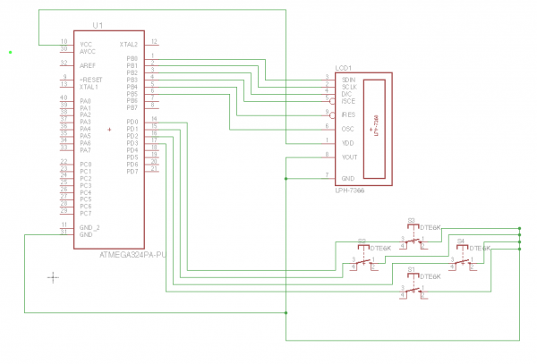
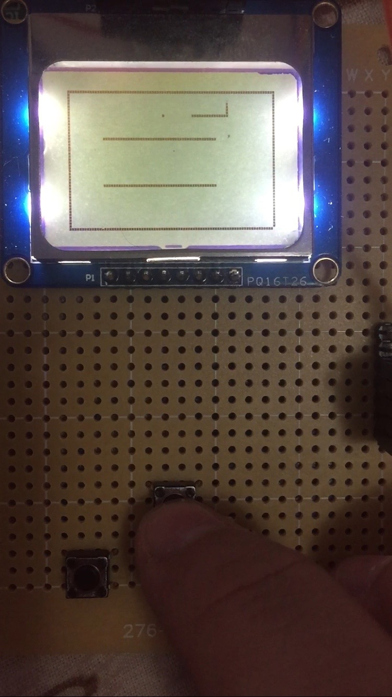
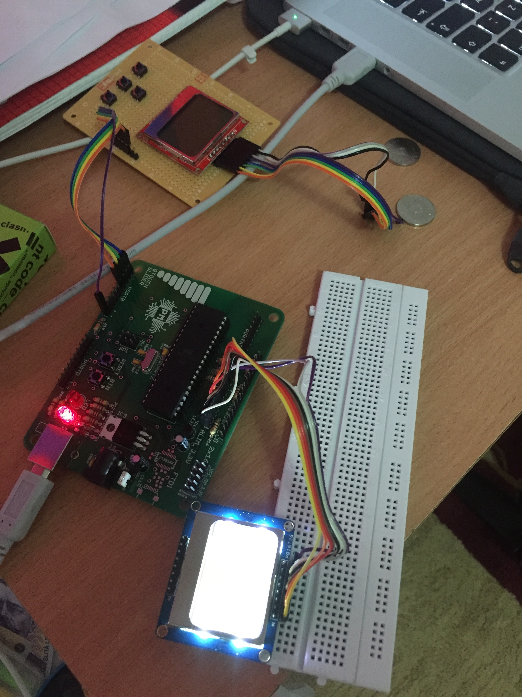

# Digital Systems Design Using Microcontrollers - Snake Game

## Components
<table>
  <tr>
    <th>Base Components</th><th>Other Components</th>
  </tr>
  <tr>
    <td valign=top>
      <ul>
          <li>ATMEGA324</li>
          <li>microcontroller base</li>
          <li>USB jack</li>
          <li>voltage stabilizer</li>
          <li>capacitors</li>
          <li>resistors</li>
          <li>diodes</li>
          <li>2 LEDs</li>
          <li>quartz</li>
      </ul>
    </td>
    <td valign=top>
      <ul>
        <li>Nokia 3110 LCD</li>
        <li>pin strips</li>
        <li>connectors</li>
        <li>buttons</li>
      </ul>
    </td>
  </tr>
</table>

## EAGLE Scheme

## Pictures

